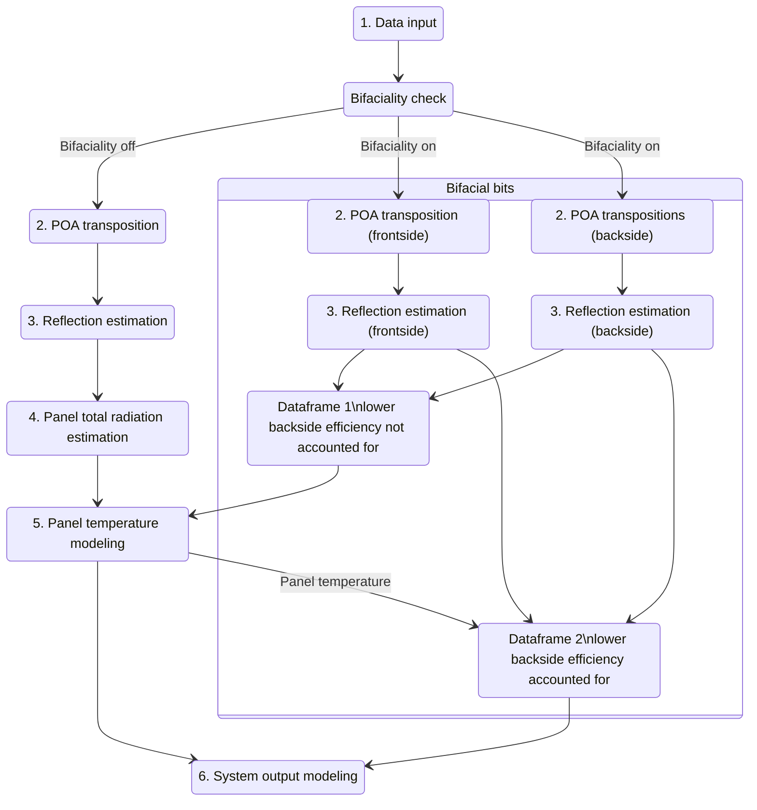

# Bifacial modeling
Version 0.1.1

---- 

## What are bifacial PV panels?
Bifacial PV panels are panels that can absorb radiation from both sides. They have become a bit more 
common during the past few years and adding modeling of bifacial systems to our package is something we
are actively working on.

Bifacial panels are often used for vertical east/west facing installations. This allows for the two sides to have their
optimal output roughly 12 hours apart, leading to more even PV output through the day.

## Enabling bifacial modeling

Bifaciality has been added to the PV model. Generating a bifacial forecast is about as simple as below:

```python
import pandas as pd
from matplotlib import pyplot as plt
import fmi_pv_forecaster as pvfc

latitude = 64
longitude = 25
tilt1 = 45
azimuth1 = 90

pvfc.set_location(latitude, longitude)
pvfc.set_angles(tilt1, azimuth1)

pvfc.set_bifacial(True) # bifaciality toggle
pvfc.set_relative_bifacial_backside_efficiency(0.90) # backside efficiency

data1 = pvfc.get_default_clearsky_forecast(5)
```

The toggle set_bifacial will enable bifaciality modeling. Backside efficiency sets a multiplier for the radiation
absorbed by the backside. This is typically between 0.7(70%) to 0.95(95%) because the wiring of individual
solar cells on the panel has to fit somewhere, and with current tech, it goes on the "backside" of the
PV cells. 

## How bifaciality changes the behavior of the model


### Monofacial path:
The diagram above shows roughly how the bifacial model works. If bifaciality is off, the data goes through the
normal monofacial model chain.

### Bifacial path:
If bifaciality is on, the system will split the processing first into two separate paths.

#### POA transpositions and reflection estimation
The first path focuses on the frontside of the system, this uses the user given panel angles and modeling works
identically to the monofacial sections of the model chain. 

Second path does the same, just by using panel angles that
are "reversed" so that we get a dataframe with reflection corrected(panel absorbed) radiation on the backside of the
bifacial panel.

#### Merging the paths

The two paths merge after reflection estimation, creating two dataframes.

**Dataframe 1** contains the columns from the frontside dataframe, but the poa_ref_cor column which contains the 
panel absorbed radiation value, is the sum of poa_ref_cor for both front and backside. 

**Dataframe 2** is as dataframe 1, but the poa_ref_cor is set to 
`poa_ref_cor_frontside + poa_ref_cor_backside*relative_efficiency`.

The need for the two dataframes is perhaps best understood via a hypothetical scenario where backside efficiency is unrealistically
low at 10% of the frontside efficiency. Temperature for this low efficiency backside bifacial panel should be about
the same(or actually even higher than the temperature of a high efficiency bifacial panel).
But if we reduce the backside 
radiation with the backside coefficient, we effectively reduce the radiation that the model uses for temperature
calculations, resulting in underestimated panel temperatures. And this is why the Dataframe 1 is needed for temperature
modeling.

In reality, the difference between backside and frontside efficiency isn't this large, but we still want to use the full
panel absorbed radiation for panel temperature calculations, and efficiency compensated radiation for system output
modeling for more accurate results.

#### Bifacial temperature calculation
The bifacial panel temperature is calculated with the efficiency-not-accounted-for Dataframe1 using the same King 
model as the monofacial pipeline, ensuring a more correct panel temperature.

**Note:** Panel temperatures may still be underestimated. The lower efficiency means that more of the solar irradiance is
transformed into heat instead of electricity. This is something we would like to model more accurately in the future.

#### Bifacial output calculation

The panel temperature calculated with the monofacial temperature model using Dataframe 1, is added to the efficiency
compensated Dataframe 2, which is then used as the input for the Huld PV panel output model.

## Issues

* Reduced backside efficiency may lead to hotter panel temperatures.
* Thinner construction may help the panels stay cooler.
* Panel degradation may happen at faster or slower speed due to different construction.
* Some of out testing data suggests that bifacial panels handle radiation coming from the
sides(at +80 deg angle of incidence) worse than monofacial panels. This may require us to modify the reflection
estimation or other parts of the model in order to compensate.

