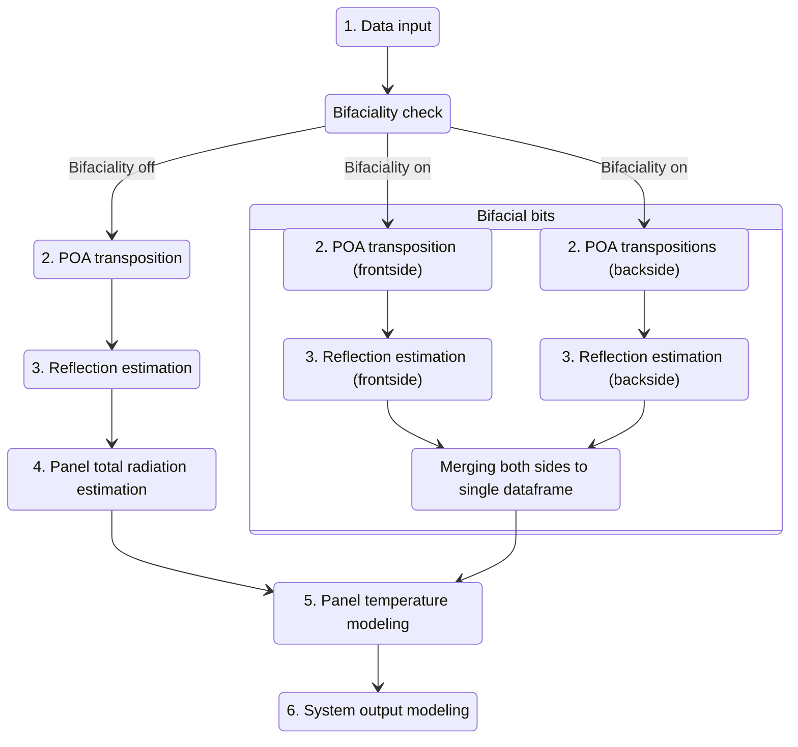

# Bifacial modeling
Version 0.1.1

---- 

## What are bifacial PV panels?
Bifacial PV panels are panels that can absorb radiation from both sides. They have become a bit more 
common during the past few years and adding modeling of bifacial systems to our package is something we
are actively working on.

Bifacial panels are often used for vertical east/west facing installations. This allows for the two sides to have their
optimal output roughly 12 hours apart, leading to more even PV output through the day.

## Enabling bifacial modeling

Bifaciality has been added to the PV model. Generating a bifacial forecast is about as simple as below:

```python
import pandas as pd
from matplotlib import pyplot as plt
import fmi_pv_forecaster as pvfc

latitude = 64
longitude = 25
tilt1 = 45
azimuth1 = 90

pvfc.set_location(latitude, longitude)
pvfc.set_angles(tilt1, azimuth1)

pvfc.set_bifacial(True) # bifaciality toggle
pvfc.set_relative_bifacial_backside_efficiency(0.90) # backside efficiency

data1 = pvfc.get_default_clearsky_forecast(5)
```

The toggle set_bifacial will enable bifaciality modeling. Backside efficiency sets a multiplier for the radiation
absorbed by the backside. This is typically less than 1.0(meaning less than 100%) because the wiring of individual
solar cells on the panel has to fit somewhere, and with current tech, it goes on the backside.

## How bifaciality changes the behavior of the model


The diagram above shows roughly how the bifacial model works. If bifaciality is toggled on, the system will
calculate plane of array transpositions with the same DNI, DHI, GHI, wind and air temp for two panels, one with the
original given panel angles, and the backside which obviously has the opposing panel angles.

After reflective losses are calculated, the radiation absorbed by the both sides is merged into a single dataframe,
which is then used to calculate the temperature and output with the same King and Huld models as if it was a 
monofacial panel.

## Possible issues

Bifacial panels might heat up faster than monofacial panels due to
lower backside efficiency.

Bifacial panels might stay cooler due to how much thinner they are.

We have access to data from a vertical east-west bifacial system, and it is displaying some unexpected characteristics.
Output during solar noon(Sun at south) should drop significantly since neither side will receive direct irradiance.
This PV model shows this 90 degree AOI dip really well, but with the testing dataset, the dip is wider and deeper,
perhaps suggesting worse shallow angle absorption or shading from the panel frame.