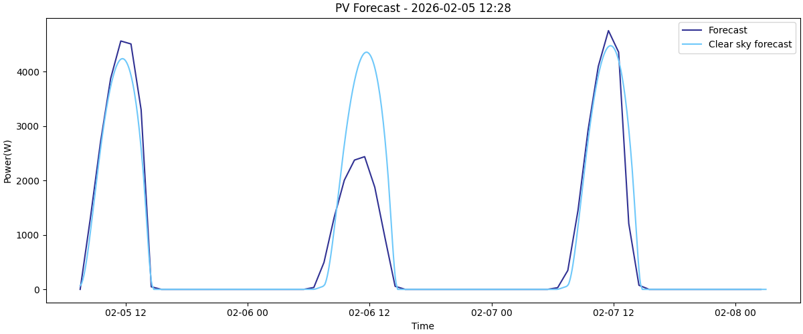
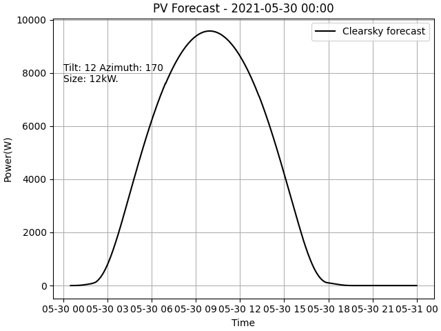
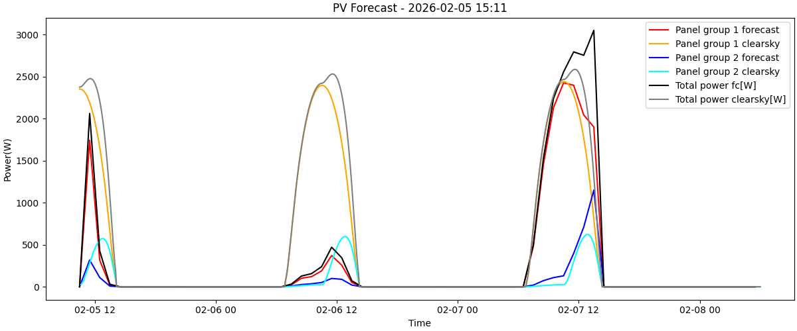

This document has examples on how to use the python package.

**Table of contents**
<!-- TOC -->
  * [Example 1: FMI weather forecast based PV system output](#example-1-fmi-weather-forecast-based-pv-system-output)
  * [Example 2: Plotting clearsky and FMI weather based forecasts into the same plot](#example-2-plotting-clearsky-and-fmi-weather-based-forecasts-into-the-same-plot)
  * [Example 3. Processing external data with the PV model](#example-3-processing-external-data-with-the-pv-model)
  * [Example 4. Forecast interpolation](#example-4-forecast-interpolation)
  * [Example 5. Estimating clearsky power for custom time interval](#example-5-estimating-clearsky-power-for-custom-time-interval)
  * [Example 6. Multiple panel angles](#example-6-multiple-panel-angles)
<!-- TOC -->
## Example 1: FMI weather forecast based PV system output
```python
import fmi_pv_forecaster as pvfc

"""
This example shows the minimal amount of needed code for forecasting PV output.
Panel angles are south facing with a tilt of 25 degrees, fairly typical for roof mounted panels.
Geolocation is within Helsinki.
Power rating set at 4kw.
"""

pvfc.set_angles(25, 180)
pvfc.set_location(60.1576,24.8762)
pvfc.set_nominal_power_kw(4)

data = pvfc.get_default_fmi_forecast()

print("Forecast:")
print(data)


```


Resulting print:
```commandline
Forecast:
                        T  wind  module_temp     output
Time                                                   
2026-01-20 10:30:00  -0.8  0.79    -0.800000   0.000000
2026-01-20 11:30:00  -0.6  1.33    -0.048916  38.589095
2026-01-20 12:30:00  -0.5  1.78    -0.136189  25.854990
2026-01-20 13:30:00  -0.7  2.30    -0.627352   5.316707
2026-01-20 14:30:00  -1.0  2.37    -0.999996   0.000000
...                   ...   ...          ...        ...
2026-01-23 01:30:00 -15.2  0.73   -15.200000   0.000000
2026-01-23 02:30:00 -15.6  0.73   -15.600000   0.000000
2026-01-23 03:30:00   NaN   NaN          NaN   0.000000
2026-01-23 04:30:00   NaN   NaN          NaN   0.000000
2026-01-23 05:30:00   NaN   NaN          NaN   0.000000
```


**Output parameters explained:**
- **Time** Datetime index, times are in UTC time.
- **T** Air temperature at 2m from ground.
- **wind** Wind speed in m/s at 2m from ground.
- **cloud_cover** Value in range [0,100]. 0 indicates clear sky, 100 for full cloud cover.
- **module_temp** Modeled module temperature in Celsius. 
- **output** Power output in watts.

---
## Example 2: Plotting clearsky and FMI weather based forecasts into the same plot

```python
import fmi_pv_forecaster as pvfc
import datetime
import matplotlib.pyplot as plt


# setting parameters
pvfc.set_angles(25, 235) # south-west facing panels
pvfc.set_location(55.6804144,12.5821649) # near Copenhagen, Denmark
pvfc.set_nominal_power_kw(10)

pvfc.set_clearsky_fc_timestep(5)

# setting parameters which affect clearsky forecast
pvfc.set_default_air_temp(-5)
pvfc.set_default_albedo(0.7)

# generating forecast
data = pvfc.get_default_fmi_forecast()

# generating clearsky forecast
data_clearsky = pvfc.get_default_clearsky_estimate()

# plotting forecast
fig, ax = plt.subplots(layout='constrained')

plt.plot(data.index, data["output"], label="Forecast", color="#303193")
plt.plot(data_clearsky.index, data_clearsky["output"], label="Cloud free forecast",  color="#6ec8fa")


# adding axis labels, titles and other text elements
ax.set_xlabel("Time")
ax.set_ylabel("Power(W)")

timenow = datetime.datetime.now()
timenow_string = datetime.datetime.fromtimestamp(timenow.timestamp()).strftime('%Y-%m-%d %H:%M')
plt.title("PV Forecast - " + timenow_string)

plt.legend(loc='upper right')

# showing plot
plt.show()
```


**Resulting plot:**




---


## Example 3. Processing external data with the PV model

```python
import pandas as pd
import fmi_pv_forecaster as pvfc

# Helper function for printing
def print_full(x: pd.DataFrame):
    """
    Prints a dataframe without leaving any columns or rows out. Useful for debugging.
    """

    pd.set_option('display.max_rows', None)
    pd.set_option('display.max_columns', None)
    pd.set_option('display.width', 1400)
    pd.set_option('display.float_format', '{:10,.2f}'.format)
    pd.set_option('display.max_colwidth', None)
    print(x)
    pd.reset_option('display.max_rows')
    pd.reset_option('display.max_columns')
    pd.reset_option('display.width')
    pd.reset_option('display.float_format')


# setting system parameters
pvfc.set_location(62.24, 24.321)
pvfc.set_angles(15, 135)
pvfc.set_nominal_power_kw(21)

# reading external radiation data csv and creating a dataframe
radiation_data = pd.read_csv("external_radiation_data.csv", index_col="time", parse_dates=["time"])

print("Radiation dataframe")
print_full(radiation_data)

# processing radiation dataframe
results = pvfc.process_radiation_df(radiation_data)

print_full(results)
```

**Resulting print:**

```commandline
Radiation dataframe
                                 dni        dhi        ghi          T       wind     albedo
time                                                                                       
2024-05-31 23:30:00+00:00       0.00       0.00       0.00      21.54       2.79       0.13
2024-06-01 00:30:00+00:00       0.00       0.00       0.00      21.72       2.96       0.13
2024-06-01 01:30:00+00:00       0.00       8.87       8.87      21.24       3.40       0.10
2024-06-01 02:30:00+00:00      95.50      54.20      65.64      21.22       3.24       0.10
2024-06-01 03:30:00+00:00     458.27      66.92     173.24      21.47       3.64       0.10
2024-06-01 04:30:00+00:00     590.50      84.46     292.00      21.91       3.97       0.10
2024-06-01 05:30:00+00:00     667.03     101.50     414.64      22.74       4.02       0.10
2024-06-01 06:30:00+00:00     686.39     127.96     524.58      23.41       4.13       0.10
2024-06-01 07:30:00+00:00     753.58     129.42     633.70      25.02       3.71       0.10
2024-06-01 08:30:00+00:00     796.70     127.66     715.04      25.67       4.00       0.10
2024-06-01 09:30:00+00:00     802.56     136.52     760.45      26.30       3.94       0.10
2024-06-01 10:30:00+00:00     711.90     189.49     749.70      25.81       3.98       0.10
2024-06-01 11:30:00+00:00     634.30     222.94     708.28      26.72       4.02       0.10
2024-06-01 12:30:00+00:00     734.87     157.84     682.21      26.03       4.39       0.10
2024-06-01 13:30:00+00:00     586.15     196.86     569.48      24.62       4.13       0.10
2024-06-01 14:30:00+00:00     154.96     359.18     442.38      25.20       3.38       0.10
2024-06-01 15:30:00+00:00       0.00     254.56     254.56      24.18       3.46       0.10
2024-06-01 16:30:00+00:00       0.00     141.07     141.07      23.66       2.07       0.10
2024-06-01 17:30:00+00:00       0.00      61.13      61.13      24.88       2.20       0.10
2024-06-01 18:30:00+00:00       1.77      25.43      25.57      23.36       4.26       0.09
                                   T       wind  module_temp     output
time                                                                   
2024-05-31 23:30:00+00:00      21.54       2.79        21.54       0.00
2024-06-01 00:30:00+00:00      21.72       2.96        21.72       0.00
2024-06-01 01:30:00+00:00      21.24       3.40        21.45      85.43
2024-06-01 02:30:00+00:00      21.22       3.24        22.91   1,031.24
2024-06-01 03:30:00+00:00      21.47       3.64        26.74   4,018.16
2024-06-01 04:30:00+00:00      21.91       3.97        31.08   7,347.98
2024-06-01 05:30:00+00:00      22.74       4.02        35.74  10,396.09
2024-06-01 06:30:00+00:00      23.41       4.13        39.40  12,714.58
2024-06-01 07:30:00+00:00      25.02       3.71        44.36  14,678.48
2024-06-01 08:30:00+00:00      25.67       4.00        46.40  15,848.84
2024-06-01 09:30:00+00:00      26.30       3.94        47.58  16,116.50
2024-06-01 10:30:00+00:00      25.81       3.98        45.78  15,293.01
2024-06-01 11:30:00+00:00      26.72       4.02        44.51  13,731.43
2024-06-01 12:30:00+00:00      26.03       4.39        41.76  12,543.36
2024-06-01 13:30:00+00:00      24.62       4.13        36.81   9,734.43
2024-06-01 14:30:00+00:00      25.20       3.38        34.67   7,211.28
2024-06-01 15:30:00+00:00      24.18       3.46        29.75   4,164.80
2024-06-01 16:30:00+00:00      23.66       2.07        26.99   2,138.73
2024-06-01 17:30:00+00:00      24.88       2.20        26.37     799.62
2024-06-01 18:30:00+00:00      23.36       4.26        23.93     245.23
```


Here the input dataframe has the following columns:
* time = UTC datatime index
* dni = direct normal irradiance [W/m²] 
* dhi = diffuse horizontal irradiance [W/m²] 
* ghi = global horizontal irradiance [W/m²] 
* T = air temperature [C]
* wind = wind speed [m/s]
* albedo = ground reflectivity [0-1]

Out of the input columns, T, wind and albedo are optional. These have in built default values which will be used when
the dataframe doesn't have the variables in the dataframe. The constants can also be manually as was done in example 2.


---


## Example 4. Forecast interpolation
The FMI forecasts may not always align with times which are convenient for the user. For example, if you are interested
in data with time resolution of 15 minutes, eq. (12:00, 12:15, 12:30,...), FMI open data time resolution is 60 minutes
and this obviously causes issues.


There are a few ways of working around the issue, none of which are perfect. This package has a built-in linear interpolation
-based solution for the problem. Linear interpolation is the process of taking two datapoints, eq. 12:30 and 13:30, drawing a line between them
and checking what the value is for 12:46. Linear interpolation doesn't have any time constraints and while the function can be used to get power(or any other) value
at 15 minute resolution, calculating a new power value for every second or every 12th second would also be possible. 

**The downside** with linear interpolation is that the actual physical transitioning between two states is not always
linear and as the data from FMI open data is already averaged, complex and variable changes in weather are reduced into
linear transitions between two states. Meteorologists could also say that the average of two weather states is not a valid
state of weather, even if it often represents actual weather quite well.


```python
import datetime
import fmi_pv_forecaster as pvfc


pvfc.set_angles(25, 235) # south-west facing panels
pvfc.set_location(57.0095361,24.06272) # near Riga, Latvia
pvfc.set_nominal_power_kw(10)

data = pvfc.get_default_fmi_forecast()

print("Forecast:")
print(data)

# printing power at mid day using interpolation
point_in_time1 = datetime.datetime(2026, 2 , 5,  12)
datapoint1 = pvfc.get_fmi_forecast_at_interpolated_time(point_in_time1)["output"]
print("Power at " + str(point_in_time1) + " = " + str(round(datapoint1)) +"W")

# printing power on an arbitrary second using interpolation
point_in_time2 = datetime.datetime(year=2026, month=2 , day=5, hour=11, minute=14, second=10)
datapoint2 = pvfc.get_fmi_forecast_at_interpolated_time(point_in_time2)["output"]
print("Power at " + str(point_in_time2) + " = " + str(round(datapoint2)) +"W")

```

**Output:**
```commandline
Forecast:
                        T  wind  module_temp       output
Time                                                     
2026-02-05 07:30:00 -13.3  4.01   -13.300000     0.000000
2026-02-05 08:30:00 -12.5  4.13    -9.948327  1017.468591
2026-02-05 09:30:00 -11.4  4.18    -7.831685  1496.741523
2026-02-05 10:30:00 -10.5  3.95    -6.247693  1788.717942
2026-02-05 11:30:00  -9.9  4.07    -6.524433  1385.580512
...                   ...   ...          ...          ...
2026-02-07 22:30:00 -13.7  2.37   -13.700000     0.000000
2026-02-07 23:30:00 -13.9  2.76   -13.900000     0.000000
2026-02-08 00:30:00   NaN   NaN          NaN     0.000000
2026-02-08 01:30:00   NaN   NaN          NaN     0.000000
2026-02-08 02:30:00   NaN   NaN          NaN     0.000000

[68 rows x 4 columns]
Power at 2026-02-05 12:00:00 = 1064W
Power at 2026-02-05 11:14:10 = 1492W
```

---
## Example 5. Estimating clearsky power for custom time interval

This sample shows how to calculate clear sky forecast for a single day at 1-minute time resolution using a time 
interval which isn't available from FMI open data.

Note that forecasting like this is not limited geographically. 

```python
import datetime
import fmi_pv_forecaster as pvfc
import matplotlib.pyplot as plt

# system parameters, declared as variables so we can also plot the same values in the plot easily
tilt = 12
azimuth = 170
size = 12 # 12kw
# setting parameters
pvfc.set_angles(tilt, azimuth) # south-west facing panels
pvfc.set_location(62.9,27.6)
pvfc.set_nominal_power_kw(size)

# setting parameters which affect clearsky forecast
pvfc.set_default_air_temp(14)
pvfc.set_default_albedo(0.2)

# generating forecast
date_start = datetime.datetime(2021,5, 30, 0, 0)
date_end = datetime.datetime(2021,5,30,23, 59)

data = pvfc.get_clearsky_estimate_for_interval(date_start, date_end, 1)
# ^ final input variable here chooses the time between measurements in minutes. 1 results in really smooth plots

# plotting forecast
fig, ax = plt.subplots(layout='constrained')

plt.plot(data.index, data["output"], label="Clearsky forecast", color="black")


# adding axis labels, titles and other text elements
ax.set_xlabel("Time")
ax.set_ylabel("Power(W)")

timenow = date_start
timenow_string = datetime.datetime.fromtimestamp(timenow.timestamp()).strftime('%Y-%m-%d %H:%M')
plt.title("PV Forecast - " + timenow_string)


# parameter string, shows in the plot
explainer_txt = "Tilt: " + str(tilt) + " Azimuth: " + str(azimuth) + "\n" + "Size: " + str(size) +"kW."
# adding the parameter string to the plot, forecast start a X position, 80% of max power as text Y.
plt.text(date_start, max(data["output"])*0.8, explainer_txt)

ax.grid()

plt.legend(loc='upper right')

# showing plot
plt.show()


```
**Resulting plot:**




---

## Example 6. Multiple panel angles

This example shows how to generate forecasts for a single PV system with 2 different panel angles.
The process is fairly similar as forecasting for a single panel system. Note that if you do not
change the coordinates(which you should not do unless the two panel groups are more than a kilometer apart),
the code will only ask the server for weather and radiation data once. This saves
bandwidth and API calls.

The same code could be used for forecasting the output of bifacial systems with some tuning. Our understanding
suggests that bifacial panels could be modeled as 2 panels with opposing directions with fairly good accuracy.


````python
import datetime
import fmi_pv_forecaster as pvfc
import matplotlib.pyplot as plt


"""
This example shows how to generate PV forecasts for a PV system with 2 panel banks with differing panel angles.
This could be used for bifacial system modeling.
"""

# Panel set 1
tilt_1 = 45
azimuth_1 = 180
size_1 = 4 # 4kw

# panel set 2
tilt_2 = 90
azimuth_2 = 270
size_2 = 2 # 2kw

# setting common variables for the PV site
pvfc.set_location(65.013297,25.4647086) # The exact location of Toripoliisi in Oulu, finland
pvfc.set_default_air_temp(15)
pvfc.set_default_albedo(0.2)
pvfc.set_clearsky_fc_timestep(5)

# setting data for set 1 and generating forecast for panel group 1
pvfc.set_angles(tilt_1, azimuth_1)
pvfc.set_nominal_power_kw(size_1)
data_for_panels1 = pvfc.get_default_fmi_forecast()
clearsky_for_panels1 = pvfc.get_default_clearsky_estimate()
# ^ these lines perform a single API call to the FMI servers

# pvfc.force_clear_fmi_cache() # this line could be used to avoid caching but why would you do that?

# setting data for set 2 and generating forecast for panel group 2
pvfc.set_angles(tilt_2, azimuth_2)
pvfc.set_nominal_power_kw(size_2)
data_for_panels2 = pvfc.get_default_fmi_forecast()
clearsky_for_panels2 = pvfc.get_default_clearsky_estimate()
# ^ that bit there does not actually perform another server requests as the radiadiation and weather data
# was cached from panel group 1 request.


# plotting forecast
fig, ax = plt.subplots(layout='constrained', figsize=(12,5))

# FMI and clearsky forecasts for the panel group 1. Using red-ish colors with less vibrant color for clearsky
plt.plot(data_for_panels1.index, data_for_panels1["output"], label="Panel group 1 forecast", color="red")
plt.plot(clearsky_for_panels1.index, clearsky_for_panels1["output"], label="Panel group 1 clearsky", color="orange")

# FMI and clearsky forecasts for the panel group 2 Using blue-ish colors with less vibrant color for clearsky
plt.plot(data_for_panels2.index, data_for_panels2["output"], label="Panel group 2 forecast", color="blue")
plt.plot(clearsky_for_panels2.index, clearsky_for_panels2["output"], label="Panel group 2 clearsky", color="cyan")

# Sum of FMI and clearsky forecasts for both panel groups, Using black-ish colors with less vibrant color for clearsky
plt.plot(data_for_panels2.index, data_for_panels1["output"]+data_for_panels2["output"], label="Total power fc[W]", color="black")
plt.plot(clearsky_for_panels1.index, clearsky_for_panels1["output"]+clearsky_for_panels2["output"], label="Total power clearsky[W]", color="grey")


# adding axis labels, titles and other text elements
ax.set_xlabel("Time")
ax.set_ylabel("Power(W)")

timenow = datetime.datetime.now()
timenow_string = datetime.datetime.fromtimestamp(timenow.timestamp()).strftime('%Y-%m-%d %H:%M')
plt.title("PV Forecast - " + timenow_string)

plt.legend(loc='upper right')

# showing plot
plt.show()


````

**Resulting plot:**

