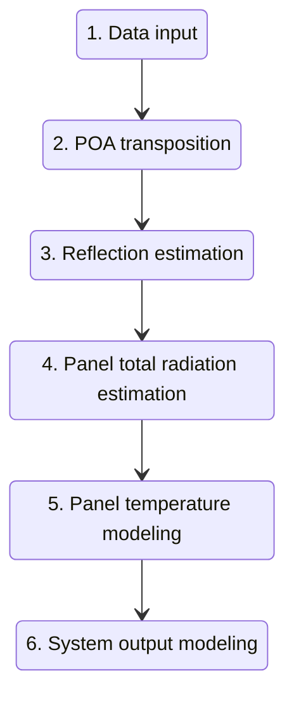
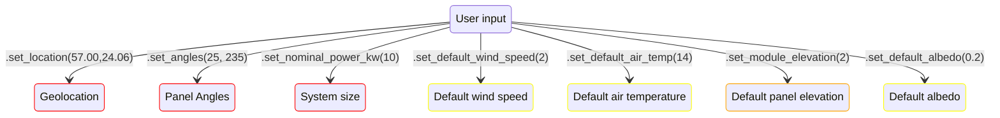
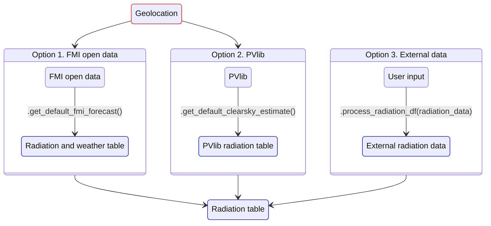
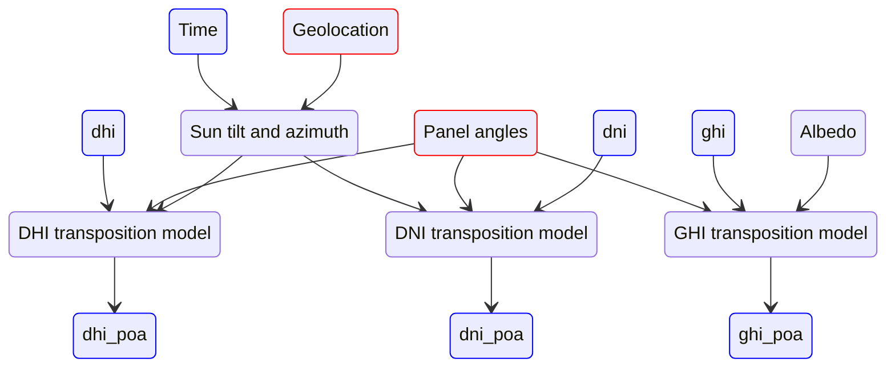

# PV model explained
This document explains the steps of the PV model. Information here can be useful for research purposes, model
validification or debugging. Understanding everything here is not necessary for casual use of the model.


## Model overview
Explained in a simplified manner, the model is made up of multiple physical models chained together, forming a
data processing pipeline. The input of this pipeline is a pandas dataframe, these can be thought as data tables with 
rows and columns. Each row 
represents a moment in time and each column represents a measurable physical value such as temperature or 
the amount some radiation type. 


The steps in the processing pipeline represent the modeling of a physical phenomena. And they add a new column 
or a set of columns to the data table.  The last step is an
exception as while it adds the output column, it also removes a large amount of the intermediary columns which
are typically not useful to the user.


**Model diagram**


**Model as code**
```python
# step 1. Loading data into the system
data = dummy_data_download_function_here()

# step 2. project irradiance components to plane of array:
data = irradiance_transpositions.irradiance_df_to_poa_df(data, site_latitude, site_longitude, panel_tilt,
                                                         panel_azimuth)

# step 3. simulate how much of irradiance components is absorbed:
data = reflection_estimator.add_reflection_corrected_poa_components_to_df(data, site_latitude, site_longitude,
                                                                          panel_tilt, panel_azimuth)

# step 4. compute sum of reflection-corrected components:
data = reflection_estimator.add_reflection_corrected_poa_to_df(data)

# step 5. estimate panel temperature based on wind speed, air temperature and absorbed radiation
data = panel_temperature_estimator.add_estimated_panel_temperature(data)

# step 6. estimate power output
data = output_estimator.add_output_to_df(data)
```


# Detailed description

Diagram guide:
- Red : Required constant
- Orange : Optional constant
- Blue : dataframe


## Step 1. Data input

This step consists of feeding the system geolocation, panel angles, system size and other needed system
parameters. And the sourcing of a radiation dataframe.

--- 
### Constant input


This is the first half of step 1. Here required(red), optional(orange) and conditional(yellow) parameters are 
fed into the system. 

- Required parameters should always be given to the PV model. System size has a default value of 1kW, but without 
geolocation or panel angles, attempting to run the model will result in a crash.

- Optional parameters increase the model performance. Default values for these parameters exist and defaults can often
be used without major modeling errors.

- Conditional parameters are only used when the dataframe generated here in step 1 does not contain the corresponding
values. For example: The FMI open data service already returns a dataframe with radiation, wind, air temp and 
albedo information. And so the conditional constants will never be used by the PV model. But as PVlib does not
attempt to estimate wind, air temp or albedo, the model has to use either the built-in constants or user given 
constants. Default constants are tuned for regular midsummer conditions.




--- 

### Radiation table sourcing

The second half of step 1. consists of choosing the source for the radiation data used by the PV model. Regardless of
which source is used, the result should be a pandas dataframe with datetime index and radiation components 
[dni, dhi, ghi] as dataframe columns. 

+ The FMI open data returns additional variables [wind, T, albedo] which increase the accuracy of the model.

+ Both FMI open data and PVlib require a valid geolocation.

+ With external data, the required columns are [dni, dhi, ghi] but one, two or all three of the additional variables
[wind, T, albedo] can also be included.





## 2. Irradiance transposition

The radiation table from step 1. should contain DNI, DHI and GHI radiation values. These three values
tell us the radiation at a specific location measured by three different methods and irradiance transposition 
is the process of calculating how much of the radiation reaches the panel surface. 

**Components**

**DNI** is the direct normal irradiance. This can be measured by a sun tracking tube where the radiation per unit of 
surface area is measured at the end of the tube. This tube is used to block radiation from the atmosphere from
influencing the results. DNI is the most significant of the three radiation components. DNI is used for calculating
the direct solar radiation on the PV panel surface.


**DHI** is the direct horizontal irradiance. This is measured with a similar instrument as DNI, but the tracker actively
block direct solar irradiance from reaching the instrument. This is done so that only the radiation scattered by the 
atmosphere is measured. DHI is used when calculating radiation scattered from the atmosphere.

**GHI** is the global horizontal irradiance. This is the total radiation reaching a horizontal plane at measuring location.
GHI measurements do not require a tracker. GHI is used when calculating radiation scattered from the ground directly
to the panel surface. 


**Physical phenomena**
````mermaid

stateDiagram-v2
    sun: Sun
    
    ground: Ground
    
    atmosphere: Atmosphere
    
    panel: Panel surface
    
    
    sun --> ground 
    sun --> panel : Direct solar radiation
    sun --> atmosphere 
    ground --> panel : Ground reflected radiation
    atmosphere --> panel : Atmosphere scattered radiation


````


**Transposition model**

As the geometry is different with all the radiation components, three transposition functions are required. The data
flow is approximately as shown in the diagram below. 



New dataframe values from the transposition phase are [dni_poa, dhi_poa, ghi_poa]. These values are kept separate
as while they do represent radiation on panel surface, reflective losses are still not accounted for and different
equations are required for each _plane of array_ transposed radiation value.

The transposition models 
https://pvpmc.sandia.gov/modeling-guide/1-weather-design-inputs/plane-of-array-poa-irradiance/calculating-poa-irradiance/poa-ground-reflected/

## Step 3. Reflection estimation


