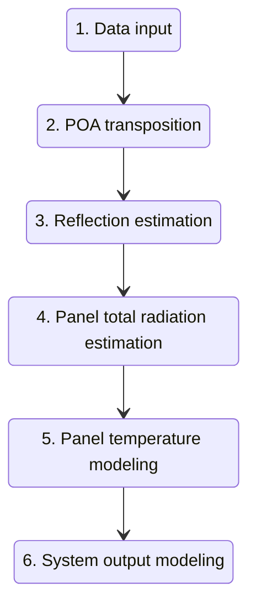
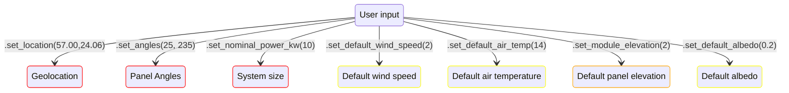
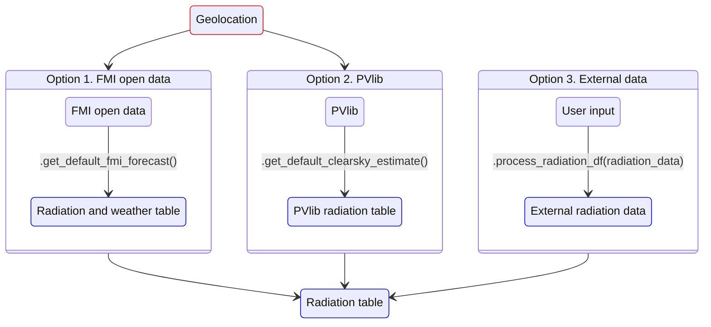
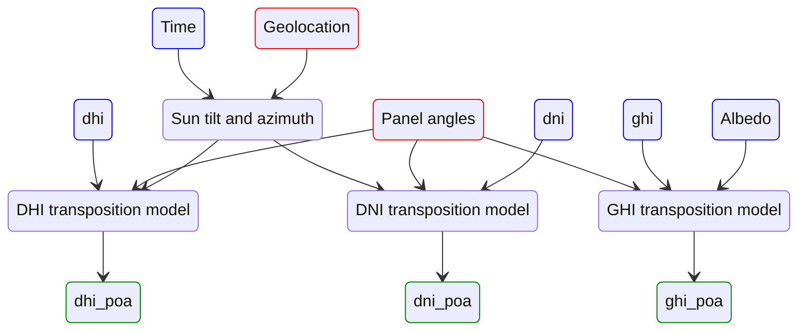
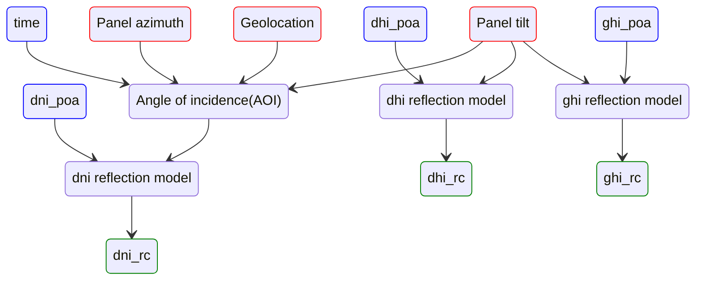
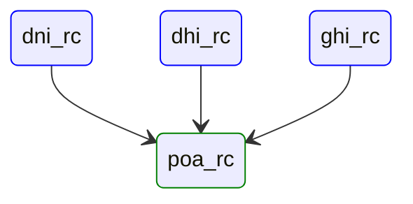
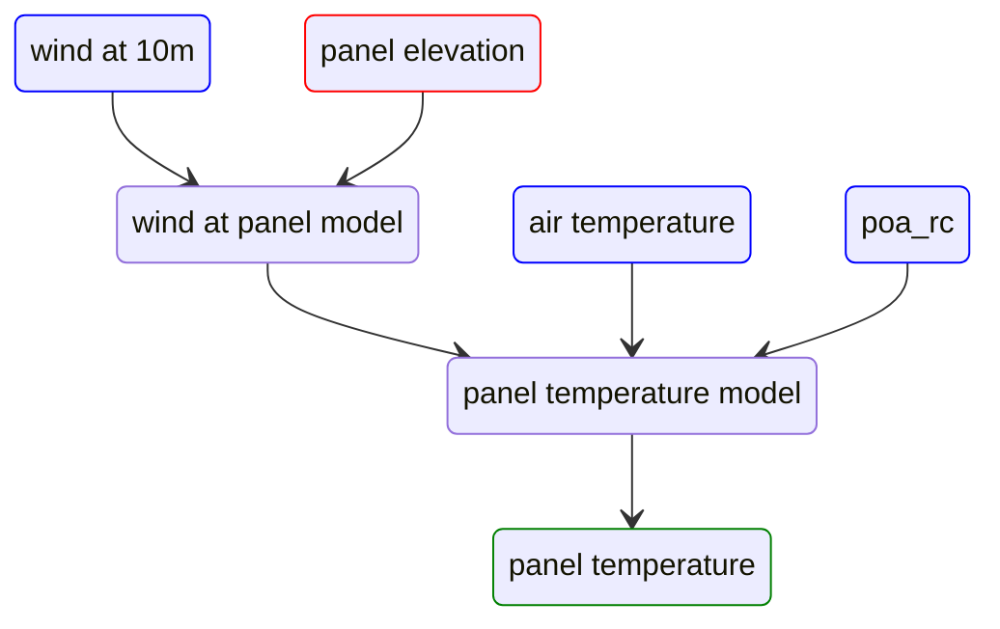
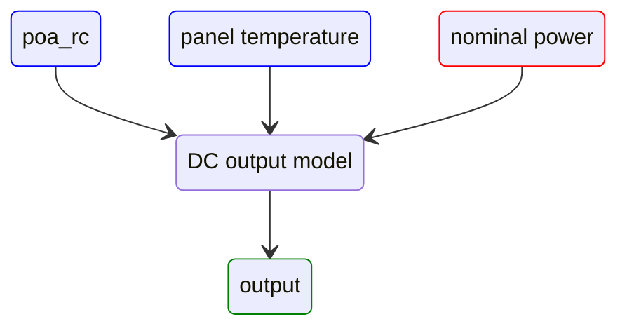
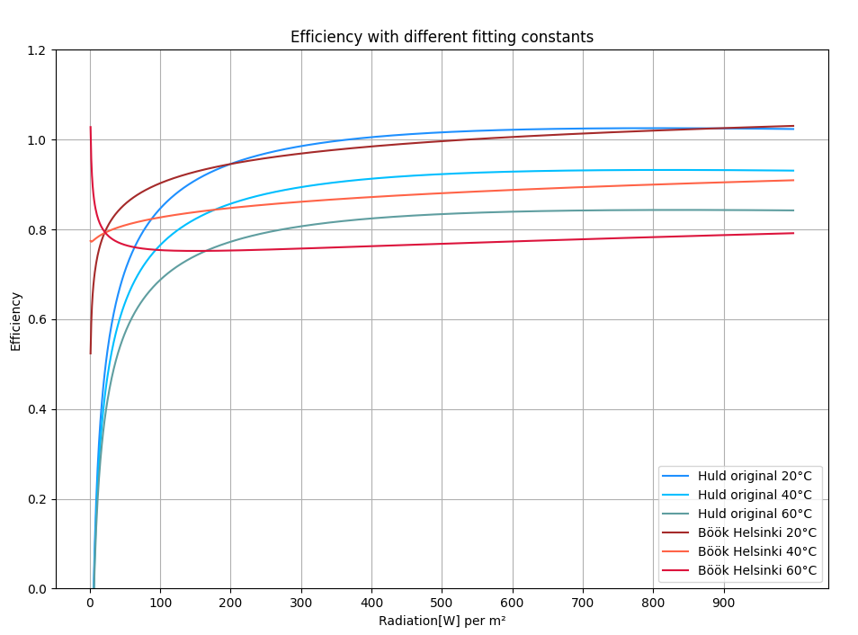

# PV model explained
This document explains the steps of the PV model. The document is split into two sections, model overview for those who
would like to understand the basics and detailed description for those who want to use the model in research applications.


## Model overview
Explained in a simplified manner, the model is made up of multiple physical models chained together, forming a
data processing pipeline. The input of this pipeline is a pandas dataframe, these can be thought as data tables with 
rows and columns. Each row 
represents a moment in time and each column represents a measurable physical value such as temperature or 
the amount some radiation type. 


The steps in the processing pipeline represent the modeling of a physical phenomena. And they add a new column 
or a set of columns to the data table.  The last step is an
exception as while it adds the output column, it also removes a large amount of the intermediary columns which
are typically not useful to the user.


**Model diagram**

**Model steps**
1. Data input: User feeds the system parameters and decides which radiation data source the model uses.
2. POA transposition: Radiation components are projected to the plane of array(POA).
3. Reflection estimation: Reflective losses for the three radiation types are calculated.
4. Panel total radiation estimation: Sum of absorbed radiation is calculated based on earlier reflective losses.
5. Panel temperature modeling: Panel temperature is estimated.
6. System output modeling: Output of the PV system is modeled using panel temperature and absorbed radiation.


### Model as a python functions

The python representation of the PV model is best thought as a single main PV model function and internal and external
helper functions.

The main PV model function is `process_radiation_df(data)` and it is also the function a user would call if they were using their
own radiation data as seen in example [link]. The input has to be a python dataframe with solar irradiance data.

Inside the main PV model function are internal helper functions which add columns to the given dataframe.
The first of these internal helpers
projects the solar irradiance to the plane of array(POA), second estimates reflective losses and so on. These 
internal helpers use the user given panel angles and other system properties together with the
current dataframe columns, or the default values built into the system if the user doesn't override them.

Outside we have external helper functions. These are available to the user and their task is to simplify using the 
PV model. For example, the function `pvfc.get_default_fmi_forecast()` is an external helper which calls other functions
in order to retrieve a radiation dataframe from FMI open data. When this dataframe is ready, it is passed to the 
main PV modeling function and the resulting output is given to the user. So in a way, the external helpers create different
radiation dataframes depending on the external helper used, and then they pass the radiation data to the common main PV
function.

This program structure ensures that no matter how the forecast is requested, the model always remains the same.


**External helper `pvfc.get_default_fmi_forecast()`:**
```python
def get_default_fmi_forecast():
    
    # creating time interval
    interval_start = datetime.datetime.now(datetime.timezone.utc).replace(tzinfo=None) - datetime.timedelta(hours=3)
    interval_end = interval_start + datetime.timedelta(hours=68)

    # retrieving forecast data from fmi servers
    data = __get_fmi_forecast_for_interval(interval_start, interval_end)

    # processing data with our pv model
    data = process_radiation_df(data)
    
    # returning results from the model
    return data
```

**Main PV model function:**
```python
def process_radiation_df(data):
    
    # step 2. project irradiance components to plane of array:
    data = irradiance_transpositions.irradiance_df_to_poa_df(data, site_latitude, site_longitude, panel_tilt,
                                                             panel_azimuth)
    
    # step 3. simulate how much of irradiance components is absorbed:
    data = reflection_estimator.add_reflection_corrected_poa_components_to_df(data, site_latitude, site_longitude,
                                                                              panel_tilt, panel_azimuth)
    
    # step 4. compute sum of reflection-corrected components:
    data = reflection_estimator.add_reflection_corrected_poa_to_df(data)
    
    # step 5. estimate panel temperature based on wind speed, air temperature and absorbed radiation
    data = panel_temperature_estimator.add_estimated_panel_temperature(data)
    
    # step 6. estimate power output
    data = output_estimator.add_output_to_df(data)

    return data
```

# Detailed description

Diagram guide:
- Red : Required constant.
- Orange : Optional constant.
- Yellow : Conditional constant(only used if DF doesn't contain value).
- Blue : Existing dataframe column.
- Green : New dataframe column added by this step.

---
## Step 1. Data input

This step consists of feeding the system geolocation, panel angles, system size and other needed system
parameters. And the sourcing of a radiation dataframe. The data input step consists of two parts, constant input
and radiation data sourcing. Constant input is the step where the user feeds in physical parameters of the PV system
and default values which the model will use if better values are not available. Radiation data sourcing is the step
where the user chooses which radiation data source the model uses. The two built-in sources are FMI open data and PVlib,
but the user can also choose to use their own radiation dataframes.

--- 
### Constant input


This is the first half of step 1. Here required(red), optional(orange) and conditional(yellow) parameters are 
fed into the system. 

- Required parameters should always be given to the PV model. System size has a default value of 1kW, but without 
geolocation or panel angles, attempting to run the model will result in a crash.

- Optional parameters increase the model performance. Default values for these parameters exist and defaults can often
be used without major modeling errors.

- Conditional parameters are only used when the dataframe generated here in step 1 does not contain the corresponding
values. For example: The FMI open data service already returns a dataframe with radiation, wind, air temp and 
albedo information. And so the conditional constants will never be used by the PV model. But as PVlib does not
attempt to estimate wind, air temp or albedo, the model has to use either the built-in constants or user given 
constants. Default constants are tuned for regular midsummer conditions.





--- 

### Radiation table sourcing

The second half of step 1. consists of choosing the source for the radiation data used by the PV model. Regardless of
which source is used, the result should be a pandas dataframe with datetime index and radiation components 
[dni, dhi, ghi] as dataframe columns. 

+ The FMI open data returns additional variables [wind, T, albedo] which increase the accuracy of the model.

+ Both FMI open data and PVlib require a valid geolocation.

+ With external data, the required columns are [dni, dhi, ghi] but one, two or all three of the additional variables
[wind, T, albedo] can also be included.



> Note: python function calls in the graph above are somewhat symbolical. The shown functions do not only 
> give the model a radiation table, but they also start the processing pipeline.

---

## 2. Irradiance transposition

The radiation table from step 1. should contain DNI, DHI and GHI radiation values. These three values
tell us the radiation at a specific location measured by three different methods and irradiance transposition 
is the process of calculating how much of the radiation reaches the panel surface. 


**Components**

**DNI** is the direct normal irradiance. This can be measured by a sun tracking tube where the radiation per unit of 
surface area is measured at the end of the tube. This tube is used to block radiation from the atmosphere from
influencing the results. DNI is the most significant of the three radiation components. DNI is used for calculating
the direct solar radiation on the PV panel surface.


**DHI** is the direct horizontal irradiance. This is measured with a similar instrument as DNI, but the tracker actively
block direct solar irradiance from reaching the instrument. This is done so that only the radiation scattered by the 
atmosphere is measured. DHI is used when calculating radiation scattered from the atmosphere.

**GHI** is the global horizontal irradiance. This is the total radiation reaching a horizontal plane at measuring location.
GHI measurements do not require a tracker. GHI is used when calculating radiation scattered from the ground directly
to the panel surface. 


**Physical phenomena**
````mermaid

stateDiagram-v2
    sun: Sun
    
    ground: Ground
    
    atmosphere: Atmosphere
    
    panel: Panel surface
    
    
    sun --> ground 
    sun --> panel : Direct solar radiation
    sun --> atmosphere 
    ground --> panel : Ground reflected radiation
    atmosphere --> panel : Atmosphere scattered radiation


````


**Transposition model**

As the geometry is different with all the radiation components, three transposition functions are required. The data
flow showing the used parameters and function is approximately as shown in the diagram below.

- Blue : value from current dataframe column.
- Red : constant given by the user.
- Green : added dataframe column. 



[dni_poa, dhi_poa, ghi_poa] values are kept separate
as while they do represent radiation on panel surface, reflective losses are still not accounted for and different
equations are required for each _plane of array_ transposed radiation value.

The transposition models used here are described by Sandia on their page. The DHI model is the most complex and the 
DHI Perez model built into PVlib itself is used. DNI and GHI transposition models are implemented in python.

[GHI model](https://pvpmc.sandia.gov/modeling-guide/1-weather-design-inputs/plane-of-array-poa-irradiance/calculating-poa-irradiance/poa-ground-reflected/),
[DNI model](https://pvpmc.sandia.gov/modeling-guide/1-weather-design-inputs/plane-of-array-poa-irradiance/calculating-poa-irradiance/poa-beam/),
[DHI model](https://pvpmc.sandia.gov/modeling-guide/1-weather-design-inputs/plane-of-array-poa-irradiance/calculating-poa-irradiance/poa-sky-diffuse/perez-sky-diffuse-model/)
descriptions on Sandia's web page.

---
## Step 3. Reflection estimation

The direction of radiation is different for the 3 radiation components and thus we need 3 relfection estimation
functions. The functions used here are from Martin & Ruiz 2001 paper which is excellent by the way.



The diagram above tells us that we need an additional value AOI in order to compute the reflective losses from direct
solar irradiance. AOI is the angle of incidence, and it tells us how far from the solar panel normal vector the ray angle
of incoming sunlight is. AOI depends on the position of the Sun and it is calculated with functions included in PVlib.

> PVlib returns apparent solar zenith and solar zenith when solar angles are requested. Apparent zenith takes the 
> influence of the atmosphere into account and it should be used.

With dhi and ghi the takeaways are that the location of the PV system, panel azimuth, time of day or solar angles do not
matter. This is a result of simplifications in the dhi and ghi models. The only relevant parameters are the 
plane of array irradiance and panel tilt angle.

**Sources:**

Martin & Ruiz 2001 
"Calculation of the PV modules angular losses under field conditions by means of an analytical model".

---

## Step 4. Total absorbed irradiance
This step merges the 3 reflection corrected plane of array irradiance values into one value poa_rc. This reflection corrected
POA irradiance value tells us the amount of radiation absorbed by the PV panels.

No complex math here:

`poa_rc = dni_rc+dhi_rc+ghi_rc`





---
## 5. Panel temperature estimation

Panel temperature is estimated with King 2004 model. 




The method for panel temperature estimation first calculates the wind experienced by the PV panels.
Weather forecasting services often report wind as wind at 10m elevation, and we can estimate wind at 
different reasonable elevations based on the 10m wind speed.

The actual panel temperature model sets panel temperature as the same as `air_temperature + A` where A is a
positive value based on absorbed radiation(poa_rc) and wind speed. Higher wind values reduce the value of A
and higher absorbed radiation values increase it.

> If the dataframe doesn't contain T column, the model will use a constant air temperature instead.
> 
> If the dataframe doesn't contain wind column, the model will use a constant wind speed instead.


**Sources:**

D.~King, J.~Kratochvil, and W.~Boyson,
Photovoltaic Array Performance Model Vol. 8,
PhD thesis (Sandia Naitional Laboratories, 2004).

---

## Step 6. Output estimation

Final output of the PV model is estimated by using Huld 2010 model. This same model is sometimes referred
as the Huld 6k model as it has 6 constants, k1, k2 ... k6 which can be used to tune the model.

The constants used are:
```python
# huld 2010 constants
k1 = -0.017162
k2 = -0.040289
k3 = -0.004681
k4 = 0.000148
k5 = 0.000169
k6 = 0.000005
```



The way the Huld model works is that it computes `efficiency` based on panel temperature and absorbed radiation
values. Output is then set to be:

`output = efficiency*rated_power*absorbed_radiation`

The Huld model calculates efficiency with a set of logarithms which were fitted to solar panel output data. This data
included a set of PV panels operating at panel temperatures of 23 to 60C and receiving between 50 to 1000W/m² of radiation.

We have decided to add a 50% lower limit to the efficiency estimated by the model. This limit was set as the efficiency
of the Huld model starts behaving erratically when radiation nears zero due to the logarithm components. And because 
the Huld model was not fitted to data which would have included low radiation values of 0 to 50W/m².

Despite the odd behavior at 0 to 50W and despite being fitted to panel temperatures of 20C or higher, the Huld model
has proven to work well with our own data.





**Sources:**

Huld 2010 model
T.~Huld, R.~Gottschalg, H.~G. Beyer, and M.~Topič,
Mapping the performance of PV modules, effects of module type and
data averaging, Solar Energy, 84 324--338 (2010).

---


