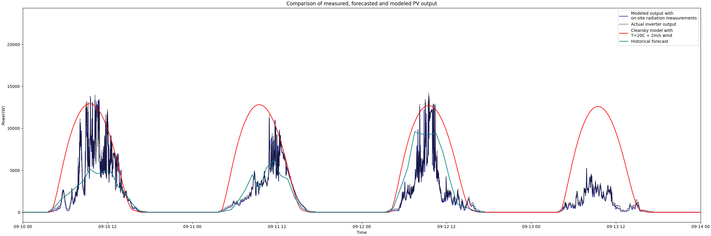

# FMI open pv forecast package

The main functionality of this package is the PV forecasting tool which is a combination of the FMI PV model and
weather forecasts from FMI open data. The resulting PV forecasting tool generates hourly weather-aware PV forecasts for 
a 66-hour period. These forecasts take panel orientation, panel surface reflections, panel temperature, and other factors
into account, resulting in generally accurate modeling of PV output when weather forecasts align with actual experienced
weather.

The forecasting package has in-built functionality for using clear sky radiation estimates from PVlib. These clear sky
forecasts can be used for testing purposes, system monitoring or in cases when internet access is not available.

The PV model can also be used with external data sources by feeding it dataframes with the required radiation components.

See [Examples](examples.md) for examples on how to use the package.
[Model explanation](model_explained.md) for details on how the PV model works.
And [Package documentation](package_documentation.md) for a programmer-oriented description of functions built
into the package. 


## **Table of contents:**
<!-- TOC -->
  * [Installing the package](#installing-the-package)
  * [FMI PV forecasts](#fmi-pv-forecasts)
    * [Forecast length and updating frequency](#forecast-length-and-updating-frequency)
    * [Geographic boundaries](#geographic-boundaries)
  * [Clear sky forecasts](#clear-sky-forecasts)
  * [Forecast accuracy](#forecast-accuracy)
* [Usage of external data instead of FMI open data](#usage-of-external-data-instead-of-fmi-open-data)
* [Usage example](#usage-example)
* [Authors and acknowledgements](#authors-and-acknowledgements)
<!-- TOC -->


## Installing the package

As of early 2026, the package is still in development phase. If you would like to try it out, download 
`fmi_pv_forecast-0.1.0-py3-none-any.whl` from the dist/ folder and install it into your
python environment. This can be done with the command `pip install --force-reinstall wheel fmi_pv_forecast-0.1.0-py3-none-any.whl`
After package is installed, it can be imported as shown in the examples.

---
## FMI PV forecasts

### Forecast length and updating frequency


**Updates:** Once per ~3 hours.

**Forecast length:** 66-hours.

**Offset:** 3 to 6 hours into the past.

**Example:**
> Forecast requested at 12:24 UTC on day 1, got forecast with interval [Day 1 9:00 UTC <-> Day 3 3:00UTC].


### Geographic boundaries

The available forecasting region depends on the radiation and weather forecasts. FMI open forecasting region 
covers Finland, Scandinavia and the baltic countries with some additional margin. 

See https://en.ilmatieteenlaitos.fi/numerical-weather-prediction for the full available forecast area.

The geographic area is split into a ~2.5km by ~2.5km grid. When data for a location is retrieved from the FMI servers,
forecast for the closest available grid point is used.


---
## Clear sky forecasts

This package also contains functions for simulating clear sky PV output using simulated radiation values using models
built into PVlib.
 These forecasts do not have geographical restrictions, and they can be computed for any time interval with any
time resolution. Another benefit is that computing them does not require internet access.

The downsides of clear sky forecasts are the complete lack of weather-awareness. The PV model requires air temperature
and wind speed values which must be manually fed to the system for clear sky forecasts to be computable. A good 
air temperature would be equal to the expected air temperature during peak production hours for the interval. Given wind 
value depends on the PV site and experienced weather. 2m/s is a fairly good default value, but values higher
or lower can be used if panels are sheltered or exposed or if the location is particularly windy.

See examples [2](examples.md#example-2-plotting-clearsky-and-fmi-weather-based-forecasts-into-the-same-plot)
and [5](examples.md#example-5-estimating-clearsky-power-for-custom-time-interval).


---
## Forecast accuracy

The forecasts accuracy depends on two factors, the accuracy of the physical PV model and the accuracy of weather forecasts
used as inputs for the PV model. In short, the model is very accurate, forecast accuracy varies a lot depending on the
weather.

**Model accuracy**

In the figure below, the inverter output of a PV system(grey) is compared against the PV model with on-site radiation and
weather measurements as inputs(blue). These lines are mostly overlapping and the deviations between the two could be caused
by small errors in the PV model itself or the short distance between the weather and radiation measuring instruments.
I would dare to make the claim that this level of accuracy is about as good as is possible without tuning
the model to a specific system.


**Forecast accuracy**

When the weather forecast based model output(teal) is compared against actual inverter output(grey), we see more significant
deviations. The weather during these days appears to have been mostly cloudy with some short periods of direct sunlight
reaching the panel system. Predicting exactly this kind of weather is hard and the teal forecast is nearly as good
as it could be with the challenging cloud situation taken into consideration.




---


# Usage of external data instead of FMI open data
The PV model was programmed in a way which makes usage of external radiation data possible. If you have
access to DNI, DHI and GHI radiation tables from a forecasting service or some other source, these 
tables can be used to simulate PV system performance.

Reasons for using external data include forecasting PV output with weather and radiation data from alternative
weather forecasting services. And research where you might have either historical forecasts or 
on-site measurements for a specific location.


See [example 3](examples.md#example-3-processing-external-data-with-the-pv-model) for how to use radiation
values from a .csv file as model inputs.


---

# Usage example
This minimal example shows how to use the forecasting tool by computing a forecast for a 4kw system.


```python
import fmi_pv_forecaster as pvfc

pvfc.set_angles(25, 180)
pvfc.set_location(60.1576,24.8762)
pvfc.set_nominal_power_kw(4)

data = pvfc.get_default_fmi_forecast()

print("Forecast:")
print(data)
```


Resulting print:
```commandline
Forecast:
                        T  wind  module_temp     output
Time                                                   
2026-01-20 10:30:00  -0.8  0.79    -0.800000   0.000000
2026-01-20 11:30:00  -0.6  1.33    -0.048916  38.589095
2026-01-20 12:30:00  -0.5  1.78    -0.136189  25.854990
2026-01-20 13:30:00  -0.7  2.30    -0.627352   5.316707
2026-01-20 14:30:00  -1.0  2.37    -0.999996   0.000000
...                   ...   ...          ...        ...
2026-01-23 01:30:00 -15.2  0.73   -15.200000   0.000000
2026-01-23 02:30:00 -15.6  0.73   -15.600000   0.000000
2026-01-23 03:30:00   NaN   NaN          NaN   0.000000
2026-01-23 04:30:00   NaN   NaN          NaN   0.000000
2026-01-23 05:30:00   NaN   NaN          NaN   0.000000
```


---


#### Authors and acknowledgements
Timo Salola.

Additional help from: Viivi Kallio, William Wandji, Anders Lindfors, Juha Karhu.

This project uses PVlib.


